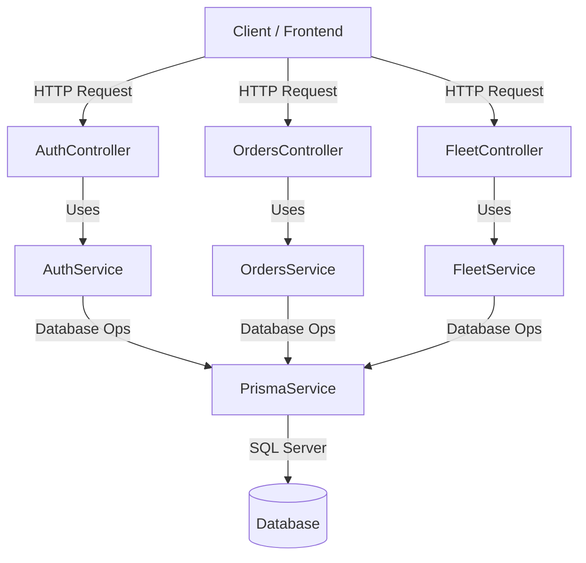

# Architecture Plan: Core NestJS Modules

## Overview
This document outlines the architectural plan for implementing the three requested NestJS core modules (`AuthModule`, `OrdersModule`, `FleetModule`) inside the backend workspace (`backend/src/`).

## Packages to Install
Since `class-validator`, `class-transformer`, and `bcrypt` (or `bcryptjs`) are required for DTO validation and secure password hashing, we need to ensure they are added to the backend dependencies:
- `class-validator`
- `class-transformer`
- `bcrypt`
- `@types/bcrypt`

## Module Breakdown

### 1. Auth Module (`backend/src/auth/`)
- **DTOs**:
  - `RegisterDto`: `email`, `password`, `fullName`, `phone`, `role` (Customer, Driver, Admin, Dispatcher) with appropriate validation decorators (`@IsEmail`, `@IsString`, `@MinLength`, etc.).
  - `LoginDto`: `email`, `password`.
- **Service (`AuthService`)**:
  - `register(dto: RegisterDto)`: Hashes password using `bcrypt`, creates user via `PrismaService`.
  - `login(dto: LoginDto)`: Finds user by email, compares hashed password using `bcrypt`, returns user info or success/token payload.
- **Controller (`AuthController`)**:
  - `POST /auth/register`
  - `POST /auth/login`
- **Module (`AuthModule`)**: Imports `PrismaModule`, declares `AuthController` and `AuthService`.

### 2. Orders Module (`backend/src/orders/`)
- **DTOs**:
  - `CreateOrderDto`: `customerId`, `volume`, `locationLat`, `locationLng`, `price` with validation decorators.
  - `UpdateOrderStatusDto`: `status` (Pending, InProgress, Completed, Cancelled).
- **Service (`OrdersService`)**:
  - `create(dto: CreateOrderDto)`: Creates a `WaterOrder` using `PrismaService`.
  - `findAll()`: Fetches all water orders.
  - `findOne(id: string)`: Fetches a specific order.
  - `updateStatus(id: string, dto: UpdateOrderStatusDto)`: Updates order status.
- **Controller (`OrdersController`)**:
  - `POST /orders`
  - `GET /orders`
  - `GET /orders/:id`
  - `PATCH /orders/:id/status`
- **Module (`OrdersModule`)**: Imports `PrismaModule`, declares `OrdersController` and `OrdersService`.

### 3. Fleet/Vehicles Module (`backend/src/fleet/`)
- **DTOs**:
  - `CreateVehicleDto`: `plateNumber`, `chassisNumber`, `status` (Active, Maintenance, Rented) with validation decorators.
  - `UpdateVehicleStatusDto`: `status`.
- **Service (`FleetService`)**:
  - `create(dto: CreateVehicleDto)`: Creates a `Vehicle` record using `PrismaService`.
  - `findAll()`: Fetches all vehicles.
  - `findOne(id: string)`: Fetches a specific vehicle.
  - `updateStatus(id: string, dto: UpdateVehicleStatusDto)`: Updates vehicle status.
- **Controller (`FleetController`)**:
  - `POST /fleet/vehicles`
  - `GET /fleet/vehicles`
  - `GET /fleet/vehicles/:id`
  - `PATCH /fleet/vehicles/:id/status`
- **Module (`FleetModule`)**: Imports `PrismaModule`, declares `FleetController` and `FleetService`.

## System Architecture Diagram

