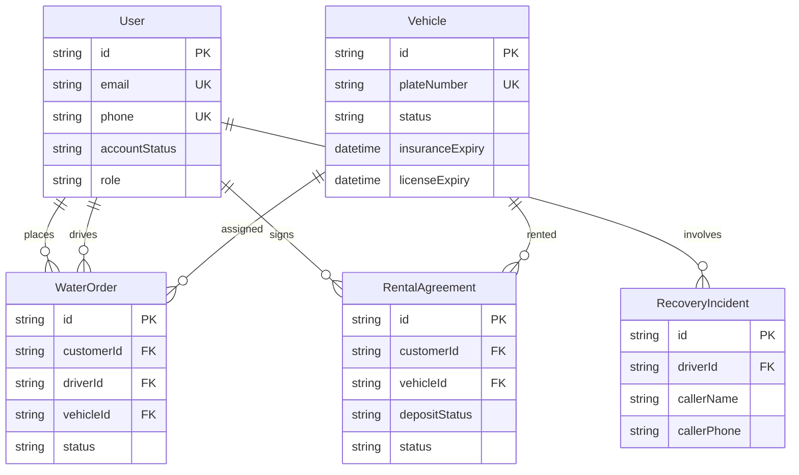

# Prisma Schema Update Plan

## Overview
This document outlines the changes required to update [`backend/prisma/schema.prisma`](backend/prisma/schema.prisma) with complete relational models, new fields, and necessary foreign key relations according to the specifications.

## Changes Details

### 1. `User` Model
- Add `accountStatus String @default("Pending")`
- Make `phone` unique (`phone String @unique`)
- Add relation fields:
  - `waterOrders WaterOrder[]`
  - `rentalAgreements RentalAgreement[]`
  - `recoveryIncidents RecoveryIncident[]` (if applicable as driver or created by)

### 2. `WaterOrder` Model
- Add optional fields for `driverId String?` and `vehicleId String?`
- Add relation fields:
  - `customer User @relation(fields: [customerId], references: [id])`
  - `driver User? @relation("DriverOrders", fields: [driverId], references: [id])`
  - `vehicle Vehicle? @relation(fields: [vehicleId], references: [id])`

### 3. `Vehicle` Model
- Add `insuranceExpiry DateTime`
- Add `licenseExpiry DateTime`
- Update status options / documentation to include `PendingInspection` (e.g. `// Enum: Active, Maintenance, Rented, PendingInspection`)
- Add relation fields:
  - `waterOrders WaterOrder[]`
  - `rentalAgreements RentalAgreement[]`

### 4. `RentalAgreement` Model (New)
- Fields:
  - `id String @id @default(cuid())`
  - `customerId String`
  - `vehicleId String`
  - `startDate DateTime`
  - `endDate DateTime`
  - `totalPrice Float`
  - `depositStatus String @default("Pending")`
  - `contractPdfUrl String?` (or String depending on requirements, let's make it optional or string)
  - `status String @default("Active")`
  - `createdAt DateTime @default(now())`
- Relations:
  - `customer User @relation(fields: [customerId], references: [id])`
  - `vehicle Vehicle @relation(fields: [vehicleId], references: [id])`

### 5. `RecoveryIncident` Model
- Make `driverId` optional (`driverId String?`)
- Add `callerName String?`
- Add `callerPhone String?`
- Add relation:
  - `driver User? @relation(fields: [driverId], references: [id])`

## Mermaid ER Diagram

